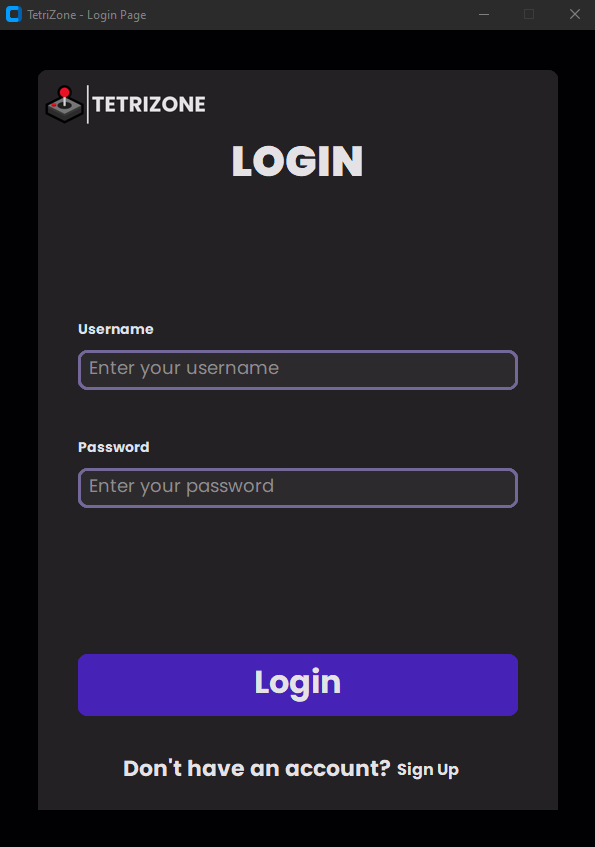
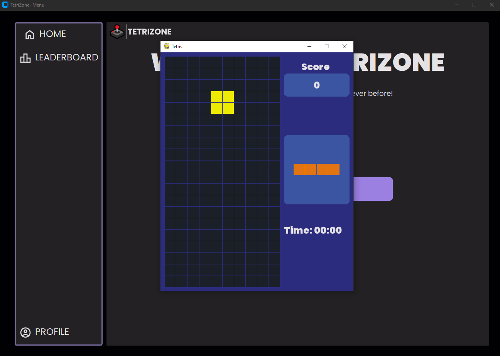

# TetriZone 


## Introduction

TetriZone is a server-client based version of the popular Tetris game. It allows users to play Tetris online, track their personal statistics, and compete with other players in real-time. The system is designed to be intuitive, modern, and user-friendly, ensuring seamless gameplay.

## Features

- **Real-time Multiplayer**: Play Tetris against other users online.
- **Personal Statistics**: Track your gameplay statistics and improve your skills.
- **Modern Design**: A sleek, intuitive interface that enhances the gaming experience.
- **Secure Login and Registration**: Safeguard your personal information with secure authentication mechanisms.

## Installation

### Prerequisites

- Ensure you have Python installed on your system.
- Required libraries: `socket`, `threading`, `sqlite3`, etc.

### Steps

1. **Clone the Repository**:
    ```sh
    git clone https://github.com/EvyatarHaim/TetriZone.git
    cd TetriZone
    ```

2. **Install Dependencies**:
    ```sh
    pip install -r requirements.txt
    ```

3. **Run the Server**:
    ```sh
    python server.py
    ```

4. **Run the Client**:
    ```sh
    python client.py
    ```

## Usage

### Login

1. Open the client application.
2. Enter your username and password to log in.
3. If you don't have an account, click on the 'Sign Up' button to register.

### Game Play

1. After logging in, you can start a new game or join an existing game.
2. Use the arrow keys to control the Tetris blocks.
3. Your score and game statistics will be updated in real-time.

### Screenshots



*Login Screen*



*In-Game Screen*

## Project Architecture

### Server-Side Capabilities

- **Authentication**: Handles user login and registration.
- **Game Management**: Manages the state of ongoing games and user interactions.
- **Database**: Stores user data and game statistics securely.

### Client-Side Capabilities

- **User Interface**: Provides a graphical interface for users to interact with the game.
- **Game Logic**: Implements the core Tetris gameplay mechanics.
- **Communication**: Sends and receives data from the server to synchronize game state.

## Challenges and Solutions

### Challenges

- Ensuring real-time synchronization between multiple clients.
- Implementing a secure authentication system.
- Designing a user-friendly and responsive UI.

### Solutions

- Utilized threading and socket programming to manage real-time communications.
- Employed encryption techniques to secure user data.
- Iteratively refined the UI based on user feedback and usability testing.

## Contribution

We welcome contributions from the community. If you wish to contribute, please fork the repository and submit a pull request.

## License

This project is licensed under the MIT License. See the [LICENSE](LICENSE.txt) file for details.

---

## Contact

For any inquiries or support, please contact:

Evyatar Haim  
Email: evyatarha9@gmail.com
